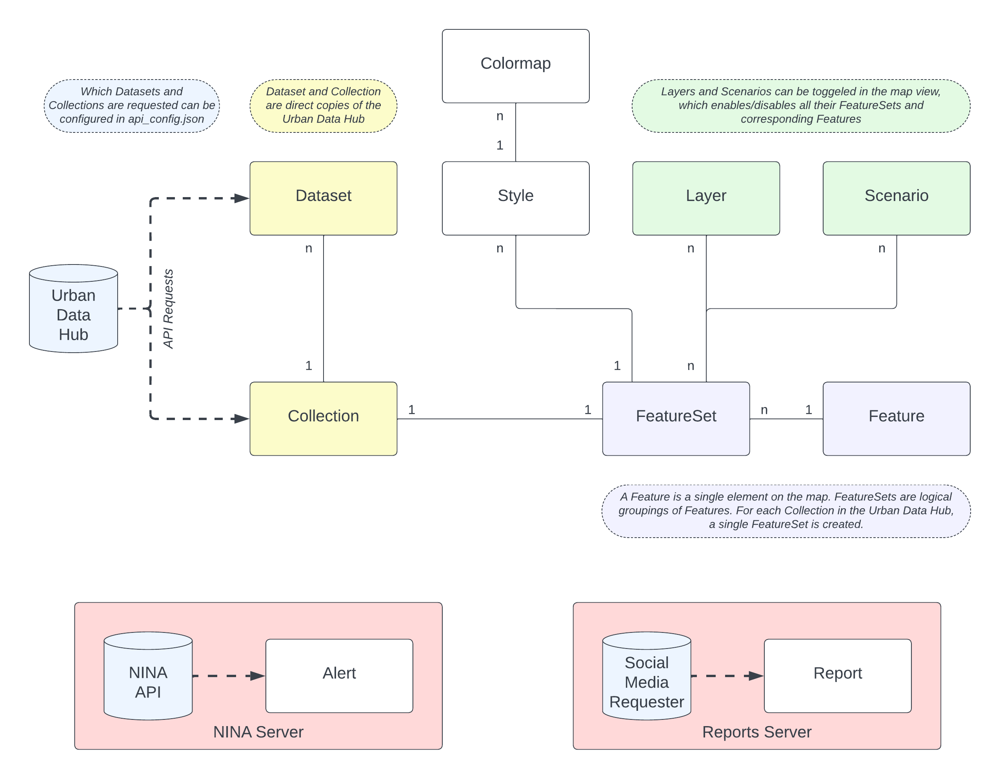

# Data Model

The data model is defined in `src/data/model.py` and consists of the following classes:

- `Feature`: Represents a single feature on the map (i.e. a single traffic light).
- `FeatureSet`: Represents a logical group of features (i.e. all traffic lights in a city).
- `Layer`: Represents a layer on the map. Toggling a layer on the map will show or hide all features from the corresponding FeatureSets assigned to the layer.
- `Dataset`: Contains the metadata about a dataset from an OGC API Features endpoint.
- `Collection`: Contains the metadata about a collection from an OGC API Features endpoint.
- `Scenario`: Scenarios are similar to Layers, but contain some more logic about how to display features and reports (i.e. the G20 summit in Hamburg). Note that this logic is currently not implemented, and Scenarios are treated like Layers in that they just toggle the Features of their assigned FeatureSets.
- `Style`: Contains information on how a feature is styled on the map (i.e. color, icon, etc). Can be assigned to a FeatureSet.
- `Colormap`: An optional additional styling information for a FeatureSet. If a Colormap is assigned to a FeatureSets Style, the features will be colored according to the colormap.
- `Alert`: Represents a single NINA API alert.
- `Report`: Represents a single social media post or news headline that is displayed in the left sidebar of the map.



## Usage
This project uses a PostgreSQL database to store the data. You can access the database with the [pgAdmin](https://www.pgadmin.org/) container that is started with the `docker-compose` command.

This project uses sqlalchemy as an ORM to interact with the database. To connect to the database and access the database objects, you can use the `autoconnect_db()` function from `src/data/connect.py`, which returns a tuple of the database engine and session. You will mostly use the session object to interact with the database. Remember to close the session after you are done with it. Here is a short example:

```python
from src.data.connect import autoconnect_db
from src.data.model import Layer

engine, session = autoconnect_db()

new_layer = Layer(name="New Layer")

session.add(new_layer)
session.commit()

session.close()
```

This will create a new `Layer` object and save it to the database.


## Feature
A Feature object represents a single feature on the map, and is the atomic unit of the data model. A Feature has the following attributes:
- `id`: Primary key of the feature. Is set automatically by the database.
- `properties`: A dictionary containing the properties of the feature. The keys are the field names, and the values are the field values. These properties can be displayed when clicking on a feature on the map. See `popup_properties` of `Style` for more information.
- `geometry_type`: The type of the geometry of the feature. Can be one of `Point`, `LineString`, `Polygon`, `MultiPoint`, `MultiLineString`, `MultiPolygon`, `GeometryCollection`.
- `geometry`: The geometry of the feature, represented with a `WKTElement` object.
- `feature_set_id`: Foreign key to the `FeatureSet` the feature belongs to.
- `feature_set`: Relationship to the `FeatureSet` the feature belongs to.

For more information about the fields `geometry_type` and `geometry`, see the [GeoJSON specification](https://en.wikipedia.org/wiki/GeoJSON) and the [GeoAlchemy2 documentation](https://geoalchemy-2.readthedocs.io/en/latest/orm_tutorial.html).

## FeatureSet
FeatureSet objects represent logical groups of features on the map. A FeatureSet has the following attributes:
- `id`: Primary key of the FeatureSet. Is set automatically by the database.
- `name`: Display name of the FeatureSet.
- `features`: Relationship to the `Feature` objects that belong to the FeatureSet.
- `layer_id`: Foreign key to the `Layer` the FeatureSet belongs to.
- `layer`: Relationship to the `Layer` the FeatureSet belongs to.
- `style_id`: Foreign key to the `Style` object that styles the features of the FeatureSet.
- `style`: Relationship to the `Style` object that styles the features of the FeatureSet.
- `collection_id`: (OPTIONAL) Foreign key to the `Collection` the FeatureSet belongs to.
- `collection`: (OPTIONAL) Relationship to the `Collection` the FeatureSet belongs to.
- `scenarios`: Relationship to the `Scenario` objects that the FeatureSet belongs to.

## Layer
A Layer object represents a toggleable layer on the map. Toggling a layer on the map will show or hide all features from the corresponding FeatureSets assigned to the layer. A Layer has the following attributes:
- `id`: Primary key of the Layer. Is set automatically by the database.
- `name`: Display name of the Layer.
- `feature_sets`: Relationship to the `FeatureSet` objects that belong to the Layer.

## Dataset
A Dataset object contains the metadata about a dataset from an OGC API Features endpoint. A Dataset has the following attributes:
- `id`: Primary key of the Dataset. Is set automatically by the database.
- `name`: Name of the Dataset.
- `url`: Base URL of the Dataset.
- `collections_identifiers`: The list of collection identifiers belonging to the Dataset to be requested. A collection identifier is the part of the URL that identifies a collection in the API. For example, the dataset `schulen` has the collections `staatliche_schulen` and `nicht_staatliche_schulen`. Only collections listed here will be requested, which lets you select only the collections you need from a dataset.
- `collections`: Relationship to the `Collection` objects that belong to the Dataset.

## Collection
A Collection object contains the metadata about a collection from an OGC API Features endpoint. A Collection has the following attributes:
- `id`: Primary key of the Collection. Is set automatically by the database.
- `name`: Name of the Collection.
- `url_items`: URL of the Collection's items endpoint. You can download the items as GeoJSON from this URL.
- `url_collection`: The URL to the collection itself.
- `entries`: The number of features in the collection.
- `dataset_id`: Foreign key to the `Dataset` the Collection belongs to.
- `dataset`: Relationship to the `Dataset` the Collection belongs to.
- `feature_sets`: Relationship to the `FeatureSet` objects that belong to the Collection.

## Scenario
Scenarios are similar to Layers, but contain some more logic about what Features and Reports to display. Currently, most of the logic is unimplemented, and Scenarios are treated identically to Layers in that they just toggle the Features of their assigned FeatureSets. A Scenario has the following attributes:
- `id`: Primary key of the Scenario. Is set automatically by the database.
- `name`: Display name of the Scenario.
- `description`: A description of the Scenario.
- `feature_sets`: Relationship to the `FeatureSet` objects that belong to the Scenario.

## Style
Style objects contain information on how a feature is styled on the map. For most styling attributes, check out the [Leaflet Path documentation](https://leafletjs.com/reference.html#path) and `model.py`. Here, we only list the custom attributes of the Style object:
- `id`: Primary key of the Style. Is set automatically by the database.
- `name`: Name of the Style. Currently unused.
- `popup_properties`: A dictionary mapping the display names of the properties to the field names of the feature. This dictionary controls which properties are displayed in the popup when clicking on a feature on the map.
- `marker_icon`: The icon to be used for the marker. Check out [fontawesome.com](https://fontawesome.com/search?o=r&ic=free&s=solid) for a list of usable icons.
- `marker_color`: The color of the marker. Possible values: ```{red, darkred, lightred, orange, beige, green, darkgreen, lightgreen, blue, darkblue, lightblue, purple, darkpurple, pink, cadetblue, white, gray, lightgray, black}```
- `collormap_id`: (OPTIONAL) Foreign key to the `Colormap` object that is used to color the features of the FeatureSet.
- `colormap`: (OPTIONAL) Relationship to the `Colormap` object that is used to color the features of the FeatureSet.
- `feature_sets`: Relationship to the `FeatureSet` objects that use the Style.

## Colormap
Colormap objects are an optional additional styling information for a FeatureSet. If a Colormap is assigned to a FeatureSets Style, the features will be colored according to the colormap.

Colormaps use a linear interpolation between the `min_value` (which corresponds to `min_color`) and the `max_value` (which corresponds to `max_color`). The `property` attribute of the Colormap is the key of the feature property that is used to select the color.

A Colormap has the following attributes:
- `id`: Primary key of the Colormap. Is set automatically by the database.
- `property`: The key of the feature property that is used to select the color.
- `min_value`: The minimum value of the property.
- `max_value`: The maximum value of the property.
- `min_color`: The hex color string that corresponds to the minimum value.
- `max_color`: The hex color string that corresponds to the maximum value.
- `style`: Relationship to the `Style` object that uses the Colormap.

## Alert
Alert objects represent [NINA API alerts](https://nina.api.bund.dev/), which are displayed in the NINA Warnings tab. While we store every field of an alert, we only display the `timestamp`, `event`, `urgency`, `sender_name`, `headline`, and `description` fields in the frontend. Refer to the [NINA API documentation](https://nina.api.bund.dev/) for more information on the fields.

## Report
Report objects represent social media posts or news headlines that are displayed in the left sidebar of the map. You can find more information on reports in [servers.md](/docs/servers.md). A Report has the following attributes:
- `id`: Primary key of the Report. Is set automatically by the database.
- `identifier`: The unique identifier that the platform uses to identify the post. This field is used to prevent duplicate reports from being saved and displayed.
- `text`: The text of the post or headline that is displayed.
- `url`: The URL to the post or news article.
- `timestamp`: The timestamp of the post.
- `source`: The source of the post (i.e. Mastodon, Reddit, etc). Reports from RSS feeds are displayed as `rss/<feed_name>`, where `<feed_name>` is the name of the feed.
- `timestamp`: The timestamp of when the post/article was published.
- `event_type`: The classified event type of the post. This field is used to filter reports by event type in the frontend.